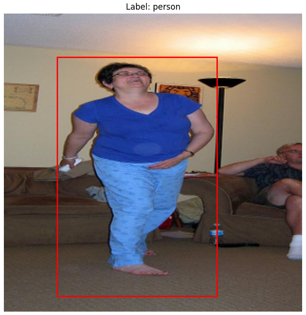
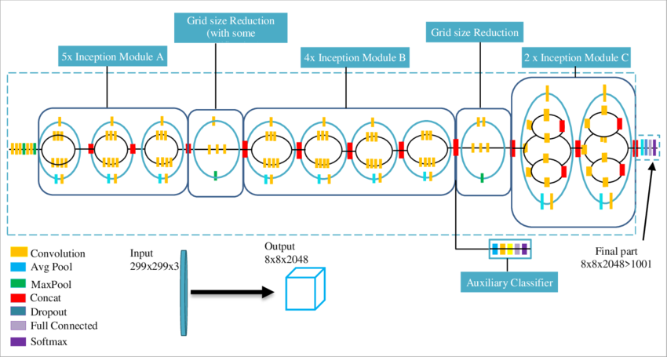
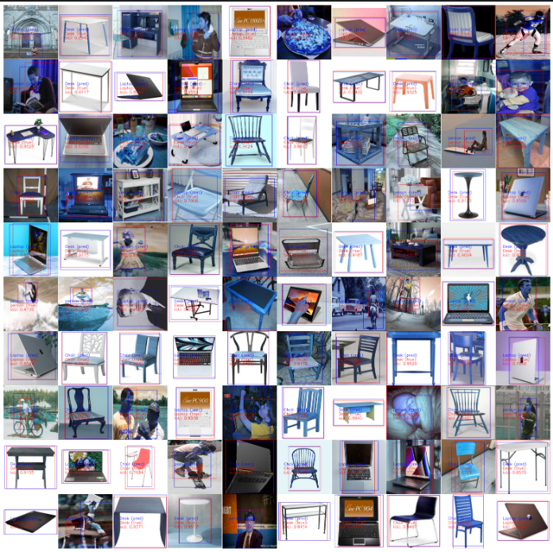

# Object Detection and Classification Project

## Project Description
This project focuses on object detection and classification in images using TensorFlow and OpenCV. It leverages the powerful deep learning capabilities of TensorFlow to train models on annotated datasets and OpenCV for image processing tasks. The goal is to accurately identify and classify objects within a variety of image contexts.

##Example images after processing data with truth label and bouding box 
<p align="center">
  
  
  
</p>


## Features
- Use of TensorFlow for model training and inference.
- Image processing and manipulation with OpenCV.
- Evaluation of model accuracy and performance metrics.
- Visualization of detection results.

## Model


## Prerequisites
Before you begin, ensure you have the following installed:
- Python 3.8 or higher
- pip (Python package installer)

## Example
You can run example notebook from `/notebooks/example.ipynb` to training model easier

## Results
<p align="center">
  
</p>

## Installation

### Setting Up a Virtual Environment
It is recommended to use a virtual environment to avoid conflicts with existing Python packages from `requirements.txt`.

#### For Unix/macOS:
```bash
python3 -m venv env
source env/bin/activate
